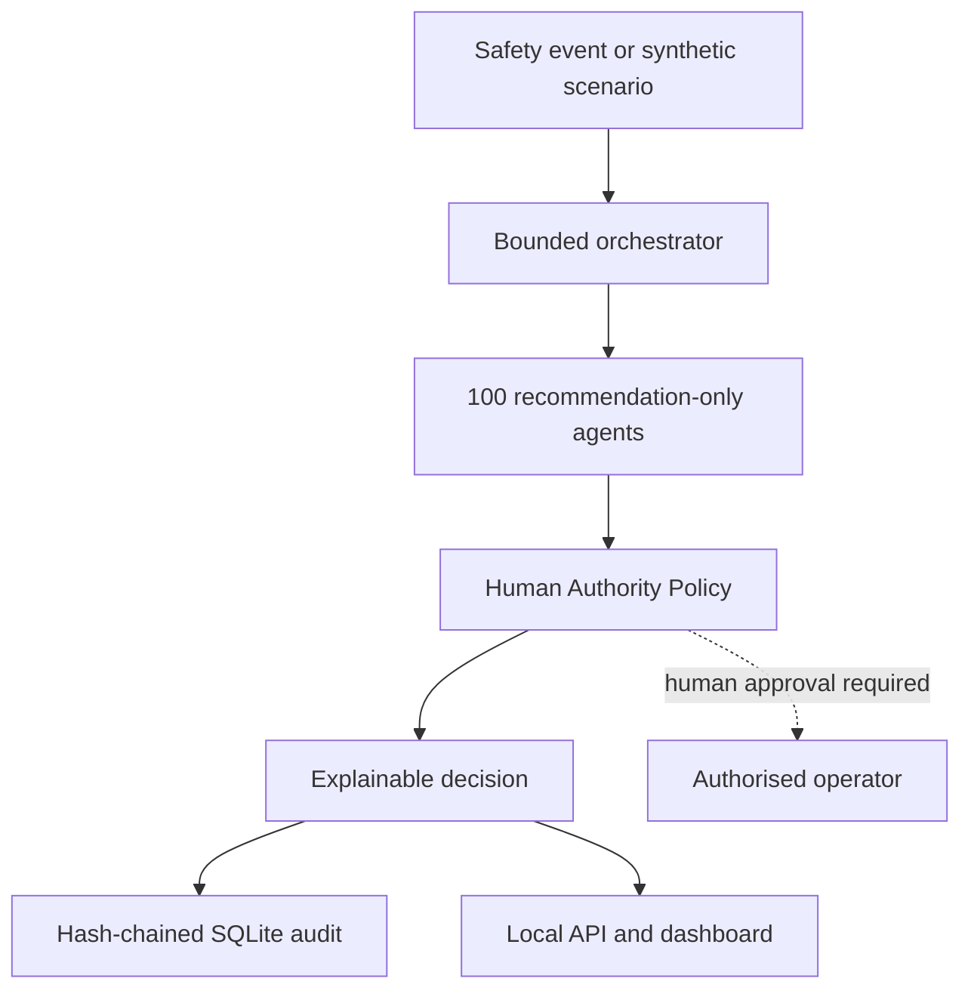

# Al-Mehdi

**A human-governed, 100-agent AI safety monitoring and incident-response laboratory.**

Al-Mehdi is an early-stage defensive research platform created by **Hassam Iqbal**. It coordinates 100 bounded software agents across 10 specialist teams to inspect safety events, identify risk signals, form an explainable consensus and preserve a hash-chained audit record.

The name *Al-Mehdi* is used here in the sense intended by the project: a protective AI-safety council designed to keep meaningful control with people.

> [!IMPORTANT]
> This project cannot guarantee prevention of a global AI catastrophe. It is a practical laboratory for monitoring, evaluation, governance and incident-response research. It does not hack external systems, retaliate, control weapons, self-replicate or autonomously execute containment actions.

## What is already implemented

- Exactly **100 unique agents** across **10 balanced teams**
- Concurrent, deterministic and explainable event assessment
- Central policy engine with mandatory human authority
- `execution_authorized = false` enforced on every decision
- Four response levels: monitor, human review, containment recommended and emergency stop recommended
- Tamper-evident SQLite audit trail using a SHA-256 hash chain
- Six safe synthetic incident scenarios
- Local JSON API and responsive web dashboard
- Command-line interface for beginners and operators
- Jupyter notebook walkthrough
- Automated tests, CI, Docker and security documentation
- No API key or paid model is required

## System architecture



The design separates **observation**, **judgment** and **authority**. The agent council may analyze and recommend. The policy engine may escalate. Only an authenticated human-controlled system added in a future reviewed release could execute a reversible response.

## The 100-agent council

| Team | Agents | Responsibility |
| --- | ---: | --- |
| Governance | 10 | Human authority, rights, evidence, due process and change control |
| Monitoring | 10 | Behaviour, telemetry, identity, permissions, networks and resources |
| Security | 10 | Prompt injection, secrets, access control and supply-chain defence |
| Alignment | 10 | Goal drift, deception indicators, power seeking and shutdown compliance |
| Data governance | 10 | Privacy, consent, provenance, minimisation, quality and bias |
| Evaluation | 10 | Robustness, calibration, hallucination, fairness and reproducibility |
| Containment | 10 | Reversible quarantine, rollback, isolation and safe-mode recommendations |
| Incident response | 10 | Severity, evidence, communication, remediation and post-incident review |
| Resilience | 10 | Integrity, backups, recovery, continuity and human fallback |
| Assurance | 10 | Risk register, safety case, audit, documentation and release gates |

Every agent has a stable ID, mission, signal vocabulary and `recommend_only` action scope. Run `python -m al_mehdi agents` to inspect all 100.

## Start here — no Jupyter required

You need Python 3.10 or newer.

```bash
git clone https://github.com/hassamiqbal/al-mehdi-ai-safety.git
cd al-mehdi-ai-safety
python -m venv .venv
```

Activate the environment:

```bash
# macOS or Linux
source .venv/bin/activate

# Windows PowerShell
.venv\Scripts\Activate.ps1
```

Install the local package and run the system check:

```bash
python -m pip install -e .
al-mehdi doctor
```

Run a safe simulated incident:

```bash
al-mehdi demo prompt_injection
al-mehdi demo goal_drift
```

Start the local dashboard:

```bash
al-mehdi serve
```

Open <http://127.0.0.1:8080>. The server deliberately binds only to your own computer by default.

## Jupyter notebook

GitHub is the correct main home for the project. Jupyter is useful only for learning and experiments. The guided notebook is at [`notebooks/01_beginner_walkthrough.ipynb`](notebooks/01_beginner_walkthrough.ipynb).

If Jupyter is installed:

```bash
jupyter lab notebooks/01_beginner_walkthrough.ipynb
```

The notebook uses synthetic examples and the same tested package; it is not a second implementation.

## API

Start the service with `al-mehdi serve`, then use:

| Method | Endpoint | Purpose |
| --- | --- | --- |
| `GET` | `/health` | Agent count, operating mode and audit health |
| `GET` | `/api/v1/agents` | The full agent registry; optionally filter with `?team=security` |
| `GET` | `/api/v1/scenarios` | Available safe simulations |
| `POST` | `/api/v1/simulate` | Run a named synthetic scenario |
| `POST` | `/api/v1/analyze` | Analyze a manually described event |
| `GET` | `/api/v1/runs` | Recent hash-chained run records |
| `GET` | `/api/v1/audit/verify` | Verify audit-chain integrity |

Example:

```bash
curl -X POST http://127.0.0.1:8080/api/v1/analyze \
  -H "Content-Type: application/json" \
  -d @config/example-event.json
```

## Test and verify

```bash
python -m unittest discover -s tests -v
python scripts/verify_100_agents.py
python -m compileall -q al_mehdi tests
```

The CI workflow repeats these checks on Python 3.10, 3.11 and 3.12.

## Docker

```bash
docker build -t al-mehdi:0.1.0 .
docker run --rm -p 127.0.0.1:8080:8080 al-mehdi:0.1.0
```

No managed-cloud deployment is claimed by this repository.

## Safety invariants

1. Human authority cannot be delegated to the agent council.
2. Agents produce recommendations and evidence, never direct external actions.
3. Tool access, outbound networking and self-modification are absent by default.
4. Containment recommendations must be reversible and evidence-preserving.
5. The system runs on synthetic or explicitly authorised data only.
6. Audit failure changes system health to `degraded`.
7. High-impact integrations require threat modelling, tests and independent human review.

See [Safety policy](docs/SAFETY_POLICY.md), [threat model](docs/THREAT_MODEL.md) and [operator runbook](docs/RUNBOOK.md).

## Current limitations

- Version 0.1.0 is a deterministic safety-control prototype, not an artificial general intelligence defence system.
- Agent judgments depend on explicit rules and provided event descriptions.
- The audit chain detects local modification but is not yet anchored to an external trusted timestamp.
- Authentication and real infrastructure connectors are intentionally not implemented.
- No external system should rely on this prototype for automatic enforcement.

## Repository status

This repository should remain **private during early development and safety review**. A public release should occur only after the threat model, documentation, tests, licensing and misuse review are approved.

## Responsible contribution

Read [CONTRIBUTING.md](CONTRIBUTING.md) before proposing changes. Do not submit offensive automation, credential theft, persistence, evasion, autonomous retaliation, weapon integration or uncontrolled self-replication.

## Citation

Citation metadata is available in [`CITATION.cff`](CITATION.cff).

## License

MIT License. See [LICENSE](LICENSE). Safety, privacy and acceptable-use responsibilities still apply.

